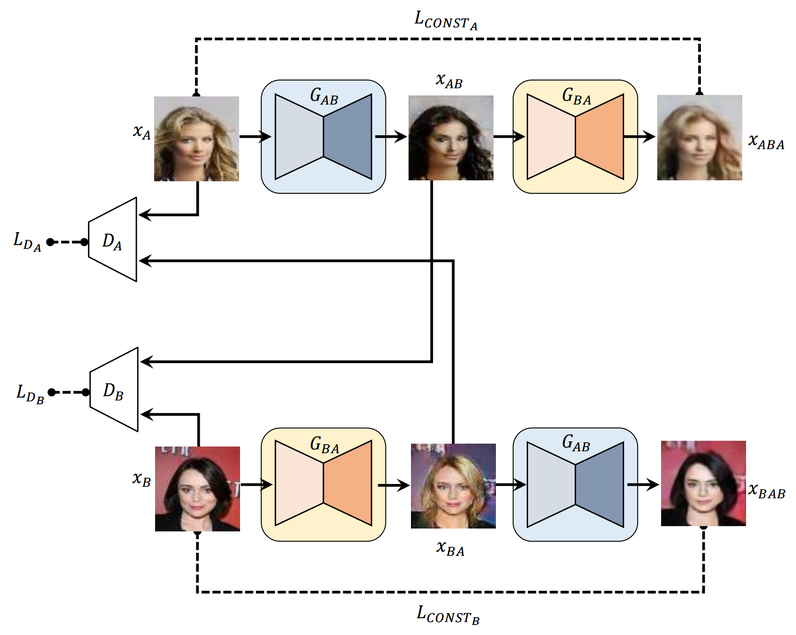

# DiscoGAN in PyTorch

PyTorch implementation of [Learning to Discover Cross-Domain Relations with Generative Adversarial Networks](https://arxiv.org/abs/1703.05192).

## Requirements

- Python 2.7
- [tqdm](https://github.com/tqdm/tqdm)
- [pytorch](https://github.com/pytorch/pytorch)

## Usage

First, download datasets (from [pix2pix](https://github.com/phillipi/pix2pix)) with:

    $ bash ./datasets/download_dataset.sh dataset_name

- `facades`: 400 images from [CMP Facades dataset](http://cmp.felk.cvut.cz/~tylecr1/facade/).
- `cityscapes`: 2975 images from the [Cityscapes training set](https://www.cityscapes-dataset.com/).
- `maps`: 1096 training images scraped from Google Maps
- `edges2shoes`: 50k training images from [UT Zappos50K dataset](http://vision.cs.utexas.edu/projects/finegrained/utzap50k/). Edges are computed by [HED](https://github.com/s9xie/hed) edge detector + post-processing.
- `edges2handbags`: 137K Amazon Handbag images from [iGAN project](https://github.com/junyanz/iGAN). Edges are computed by [HED](https://github.com/s9xie/hed) edge detector + post-processing.

To train a model:

    $ python main.py --dataset=shoes
    $ python main.py --dataset=facades

To test a model:

    $ python main.py --load_path=### --is_train=False

## Results

### Toy dataset

### Shoe dataset

(in progress)

## Author

Taehoon Kim / [@carpedm20](http://carpedm20.github.io)
